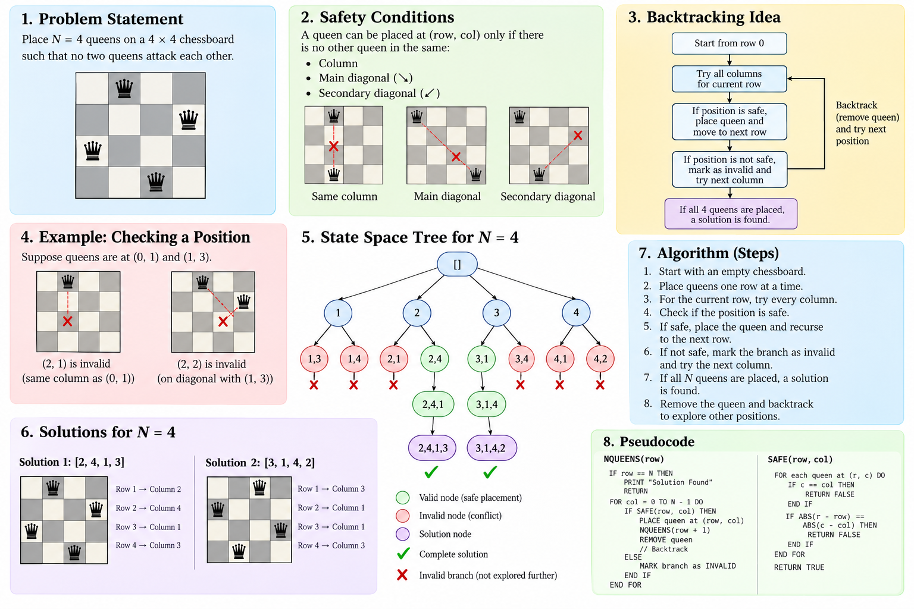
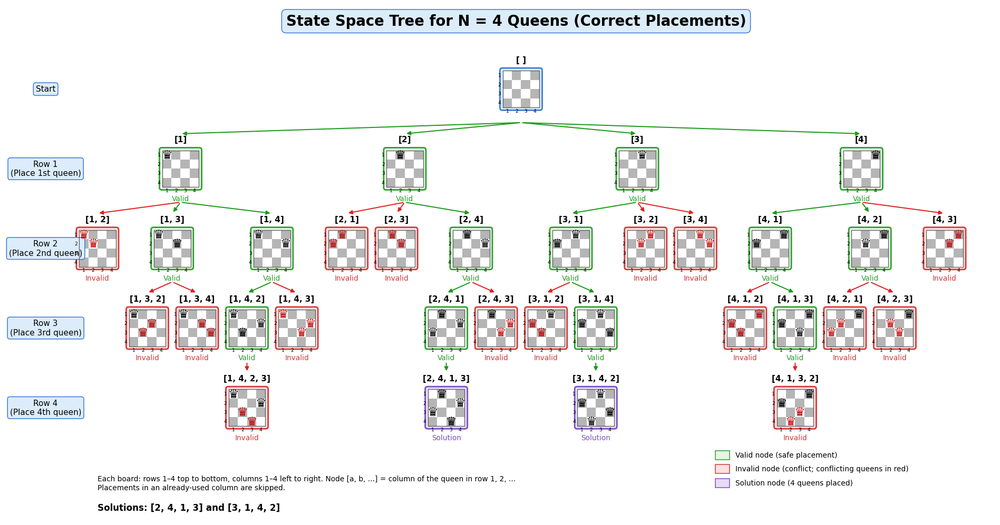

# ♛ N-Queens — Backtracking & State Space Tree (N = 4)

A Java implementation of the **N-Queens problem** using recursive backtracking, along with visualizations of the state space tree and the backtracking flow for a 4 × 4 board.


---

## 📖 About

The N-Queens problem asks you to place `N` queens on an `N × N` chessboard so that no two queens attack each other, meaning no two share a column or a diagonal. This repository solves it for **N = 4**, which has exactly **2 valid solutions**, and visualizes how the search prunes invalid branches along the way.

## ✨ Features

- Row-by-row placement using recursive backtracking (DFS)
- Early pruning of unsafe placements
- Console output of every valid board
- State space tree diagram showing safe, invalid, and solution nodes
- Flow diagram of the backtracking decision process

## 📁 Repository Structure

```text
N-Queens/
├── NQueens.java            # Backtracking solver
├── README.md               # Project documentation
├── state-space-tree.png    # State space tree visualization
└── backtracking-flow.png   # Backtracking flow diagram
```

## 🚀 Getting Started

**Prerequisites:** JDK 8 or higher.

```bash
# Compile
javac NQueens.java

# Run
java NQueens
```

To solve for a different board size, change the `N` constant at the top of `NQueens.java`.

## 📤 Sample Output

```text
. Q . .
. . . Q
Q . . .
. . Q .

. . Q .
Q . . .
. . . Q
. Q . .
```

The two solutions, as column positions per row, are `[2, 4, 1, 3]` and `[3, 1, 4, 2]`.

## 🧠 How It Works

1. Place one queen per row, starting from row 0.
2. For each column in the current row, check whether the square is safe (no queen in the same column or on the same diagonal).
3. If safe, place the queen and recurse to the next row.
4. If unsafe, prune that branch immediately.
5. After exploring a placement, remove the queen and try the next column (backtrack).
6. When all `N` queens are placed, a solution is found and printed.

Because conflicts are checked as each queen is placed, invalid branches are cut off early instead of generating every arrangement and filtering afterwards.

## 🖼️ Visualizations

| Concept | Algorithm Flow |
|:---:|:---:|
|  |  |

- 🟢 **Green** — safe placements
- 🔴 **Red** — invalid placements (pruned)
- 🟣 **Purple** — complete solutions

## 📊 Summary

| Property | Value |
|---|---|
| Board size | 4 × 4 |
| Queens | 4 |
| Approach | Recursive backtracking (DFS) |
| Valid solutions | 2 |
| Time complexity | O(N!) |
| Space complexity | O(N) |

## 🎯 Learning Outcomes

- Understand how backtracking explores a state space
- Read and draw a state space tree
- See how pruning reduces the search effort
- Practice recursion with a classic algorithmic problem